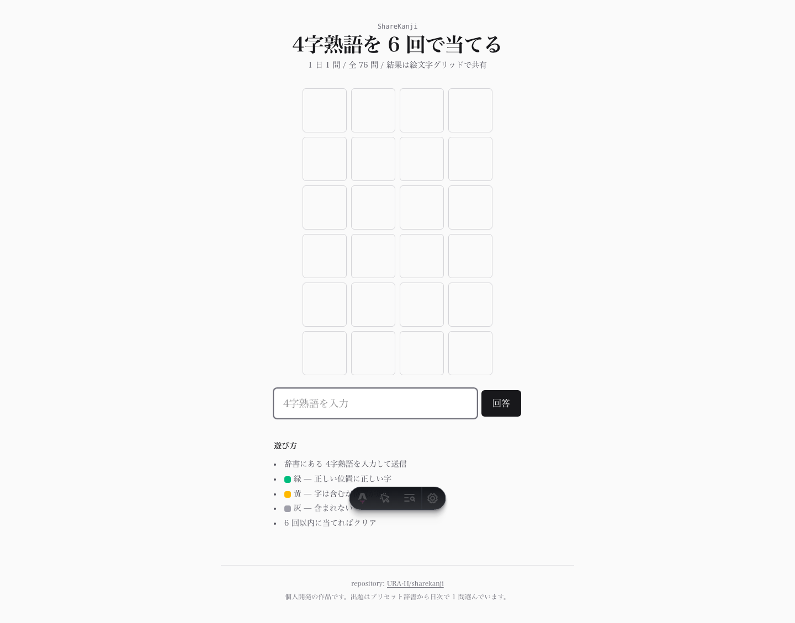
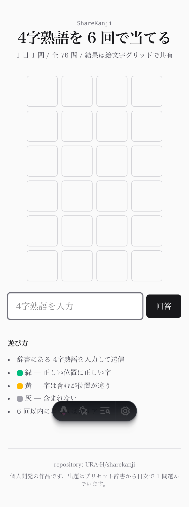

# ShareKanji

> 1 日 1 問、4字熟語を 6 回で当てる Wordle 風の daily パズル。結果は絵文字グリッドで X に共有できます。

[](https://astro.build/)
[](https://tailwindcss.com/)
[](https://www.typescriptlang.org/)
[](https://vitest.dev/)

🔗 **Live**: https://ura-h.github.io/sharekanji/

---

## 目次

- [どんなアプリか](#どんなアプリか)
- [スクリーンショット](#スクリーンショット)
- [ルール](#ルール)
- [使っている技術](#使っている技術)
- [仕組みの中身](#仕組みの中身)
- [ローカルで動かす](#ローカルで動かす)
- [デプロイ](#デプロイ)
- [今後やりたいこと](#今後やりたいこと)
- [このリポジトリについて](#このリポジトリについて)

---

## どんなアプリか

**4字熟語版の Wordle** です。1 日 1 問、6 回以内に当てます。結果は絵文字グリッドで SNS に共有できます。

```
ShareKanji #5  3/6
⬜⬜🟩⬜
🟩🟨🟩⬜
🟩🟩🟩🟩
https://ura-h.github.io/sharekanji/
```

特長:
- **API 不要・サーバ不要**。完全な静的サイトで動く
- **ログイン不要**。`localStorage` に当日進捗を残すだけ
- **辞書は 70+ の有名 4字熟語**。日々増やしていけます
- **絵文字グリッド**は文字色を伝えず難易度感だけ共有 → ネタバレなしで誇示可能

---

## スクリーンショット

| 画面 | 説明 |
|------|------|
|  | プレイ画面（デスクトップ） |
|  | プレイ画面（モバイル） |

撮影は [routeshot](https://github.com/URA-H/routeshot) CLI で生成（設定は `routeshot.config.json`）。

---

## ルール

1. 辞書にある 4字熟語を入力して送信
2. 各文字に色がつきます:
    - 🟩 **緑** — 正しい位置に正しい字
    - 🟨 **黄** — 字は含むが位置が違う
    - ⬜ **灰** — 含まれない
3. 6 回以内に当てればクリア

重複文字（例: 「一期一会」の「一」が 2 つ）の扱いは **本家 Wordle と同じロジック**で実装しています（1st pass で hit、2nd pass で残カウントから present を判定）。

---

## 使っている技術

| カテゴリ | 採用技術 |
|----------|----------|
| サイトジェネレータ | **Astro 5**（完全な静的サイト） |
| スタイル | Tailwind CSS v4 |
| 言語 | TypeScript 5 |
| テスト | Vitest 2 |
| ホスティング | GitHub Pages |

依存は最小限。アニメーションライブラリも入れていません。

---

## 仕組みの中身

### 1. 日次パズル選定

[`src/lib/game.ts`](./src/lib/game.ts) の `getPuzzleForDate()` で、日付差から決定論的にパズル番号を選びます:

```typescript
const EPOCH = new Date("2026-06-01T00:00:00+09:00");
const elapsed = Math.floor((date - EPOCH) / DAY_MS);
const puzzleNumber = elapsed + 1;
const answer = DICTIONARY[elapsed % DICTIONARY.length];
```

同じ日なら同じパズルが返ります（深夜 0 時の JST 切り替わり）。

### 2. 評価ロジック（Wordle 互換）

```typescript
// 1st pass: 完全一致 (hit)
for (let i = 0; i < 4; i++) {
  if (guess[i] === answer[i]) states[i] = "hit";
  else remaining[answer[i]] += 1;
}
// 2nd pass: 残カウントで present を判定
for (let i = 0; i < 4; i++) {
  if (states[i] === "hit") continue;
  if (remaining[guess[i]] > 0) {
    states[i] = "present";
    remaining[guess[i]] -= 1;
  }
}
```

これにより「答え 一期一会 に 一一一一 を当てる」と最初の 2 つだけ hit、3 つ目以降は miss になります（11 件のテストで担保）。

### 3. 状態の永続化

`localStorage` キー `sharekanji:{puzzleNumber}` に進捗を保存。日付が変われば自動で新しい盤面に切り替わります。サーバを持たない代わりに、進捗はブラウザ単位で持ちます。

### 4. シェア用テキスト

```typescript
function buildShareText(puzzleNumber, guesses, solved, siteUrl) {
  const score = solved ? `${guesses.length}/6` : "X/6";
  const grid = guesses.map((g) =>
    g.states.map((s) => s === "hit" ? "🟩" : s === "present" ? "🟨" : "⬜").join("")
  ).join("\n");
  return `ShareKanji #${puzzleNumber}  ${score}\n${grid}\n${siteUrl}`;
}
```

「X で共有」ボタンは `twitter.com/intent/tweet` にこのテキストを乗せます。

---

## ローカルで動かす

```bash
git clone https://github.com/URA-H/sharekanji.git
cd sharekanji
pnpm install
pnpm dev          # http://localhost:4321/sharekanji/
```

テスト:

```bash
pnpm test         # 11 件の評価ロジックテスト
pnpm typecheck    # Astro + TS チェック
```

---

## デプロイ

このリポジトリは main への push で GitHub Pages に自動デプロイされます (`.github/workflows/deploy.yml`)。

1. GitHub Pages を **Settings → Pages → GitHub Actions** に設定
2. main に push
3. `https://URA-H.github.io/sharekanji/` で公開

---

## 今後やりたいこと

- [ ] 辞書を 365 問以上に拡張（年間ストック）
- [ ] 連続正解日数の表示
- [ ] 結果ページから当日の意味解説への遷移
- [ ] 過去のパズルにアーカイブモードでアクセス
- [ ] ダークモード切り替え UI（現状は OS 追従のみ）

---

## このリポジトリについて

個人開発の作品です。1 日 1 問の daily ゲームというフォーマットと、絵文字グリッドのシェア機構を試したくて作りました。

姉妹リポジトリ:
- [URA-H/trending-lens](https://github.com/URA-H/trending-lens) — GitHub Trending を Claude が要約する静的ダッシュボード
- [URA-H/stocklens](https://github.com/URA-H/stocklens) — 株式分析 SaaS
- [URA-H/hoshi-yomi-ai](https://github.com/URA-H/hoshi-yomi-ai) — 東洋占術 AI

## ライセンス・注意事項

- 本プロジェクトは学習・個人開発目的のものです
- 4字熟語の意味解説は一般的な辞書に基づきますが、正確性を保証するものではありません
